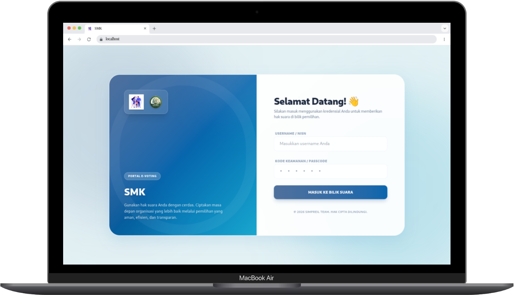
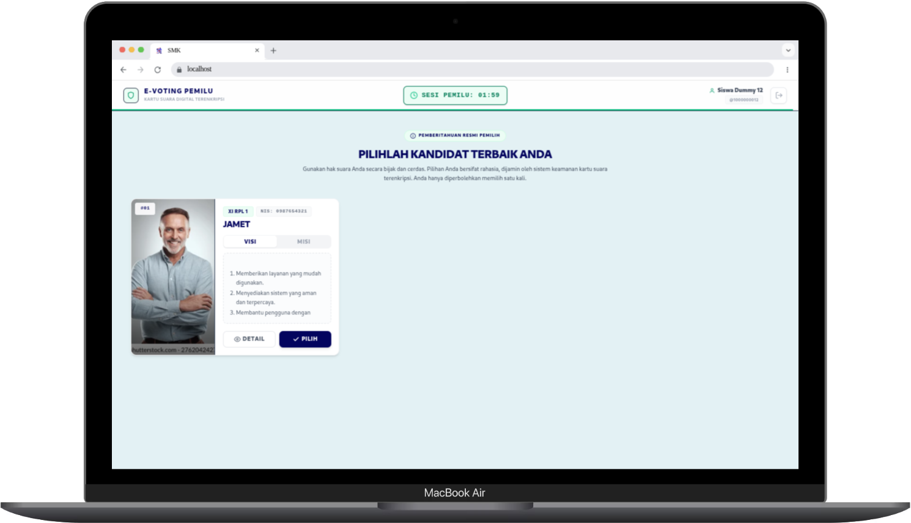
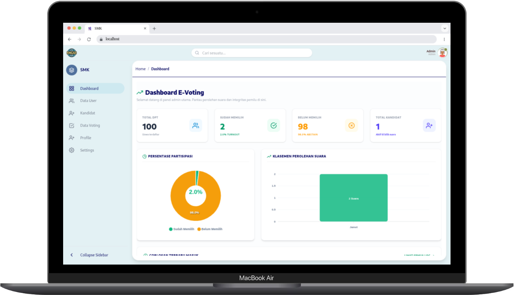
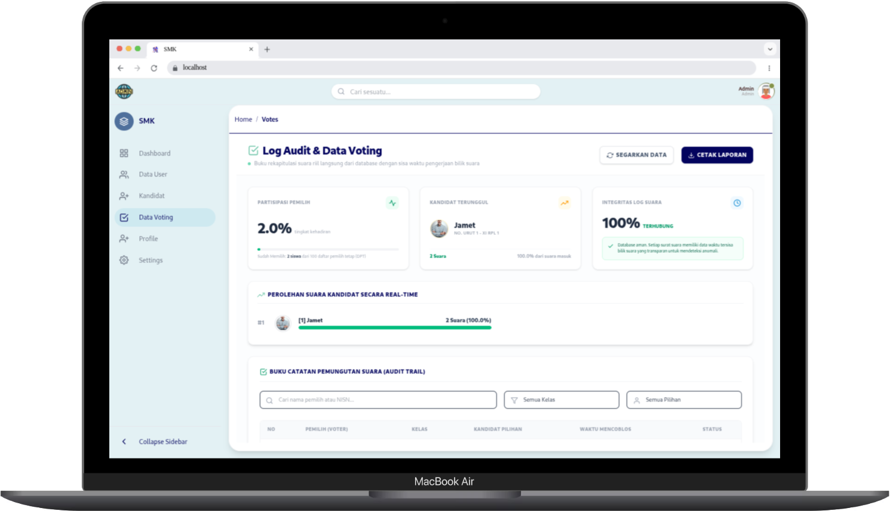
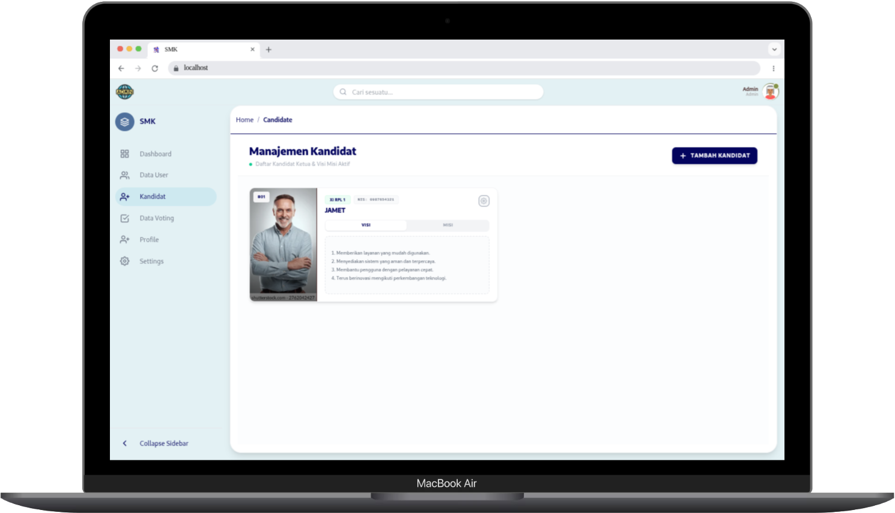
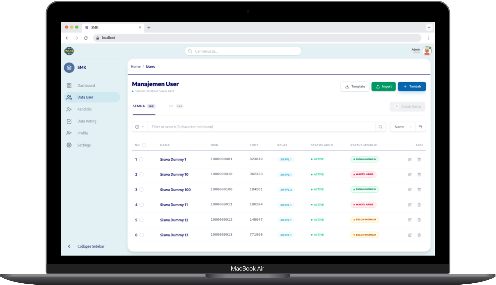
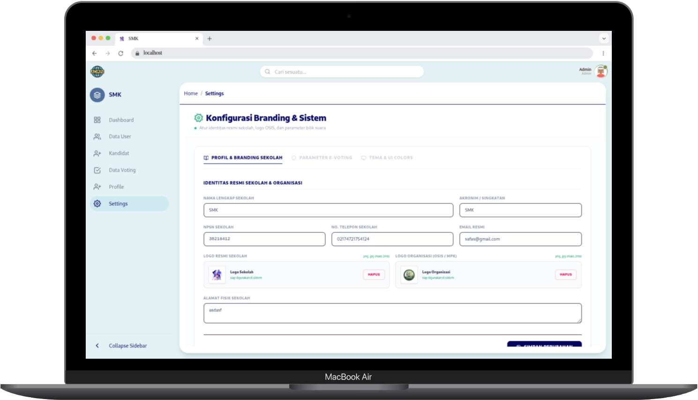
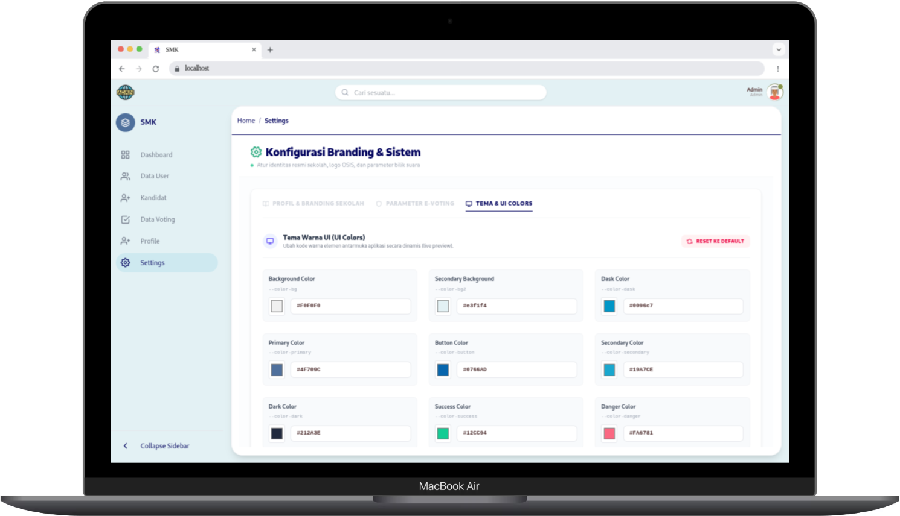
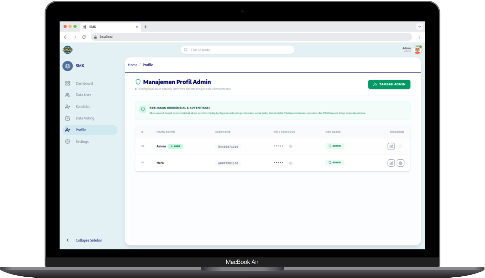

# 🗳️ E-Voting KKS - Sistem Kependudukan & Pemilihan

Aplikasi **E-Voting KKS** adalah platform modern berbasis web yang dirancang untuk mempermudah, mengamankan, dan mendigitalkan proses pemilihan kandidat. Aplikasi ini dilengkapi dengan sistem manajemen data pemilih, kustomisasi tema dinamis, hingga pembuatan laporan PDF otomatis.

---

<details>
<summary><b>1. 🐳 Setup Docker (Deployment)</b></summary>
<br>

Sistem ini sangat mudah di-deploy karena sudah dibungkus menggunakan arsitektur Docker (Frontend, Backend, dan Database MySQL).

1. Pastikan Anda sudah menginstal **Docker** dan **Docker Compose** di komputer atau server Anda.
2. Buka terminal di folder root proyek ini, lalu jalankan perintah berikut untuk mem-build dan menyalakan semua sistem:
   ```bash
   docker-compose up -d --build
   ```
3. Akses aplikasi melalui browser:
   - **Aplikasi Web (Siswa & Admin)**: `http://localhost:5173`
   - **Backend API**: `http://localhost:37900`
   - **Database MySQL**: Akses via port `3307`

</details>

<details>
<summary><b>2. 🔐 Konfigurasi Environment (.env)</b></summary>
<br>

Agar siap digunakan di *production*, kredensial aplikasi dipisahkan ke dalam file `.env`. Anda perlu membuat dua file `.env` di folder `backend/` dan `frontend/`.

**A. Backend (`backend/.env`)**
Simpan konfigurasi database MySQL dan kunci akses Cloudinary (untuk upload gambar):
```env
PORT=37900
API_PATH=v1/api

# Konfigurasi Database MySQL
DB_HOST=localhost # (Ubah ke nama service db jika menggunakan Docker network)
DB_USER=user
DB_PASSWORD=user123
DB_NAME=kks
DB_PORT=3307

# Konfigurasi Cloudinary Storage
CLOUDINARY_CLOUD_NAME=your_cloud_name_here
CLOUDINARY_API_KEY=your_api_key_here
CLOUDINARY_API_SECRET=your_api_secret_here
```

**B. Frontend (`frontend/.env`)**
Tentukan alamat server Backend agar Frontend tahu harus mengambil data ke mana:
```env
# Alamat URL Backend
VITE_API_BASE_URL=http://localhost:37900
```
</details>

<details>
<summary><b>3. 📸 Galeri & Preview Aplikasi</b></summary>
<br>

Berikut adalah cuplikan tampilan (*screenshot*) dari aplikasi E-Voting KKS. Sistem didesain dengan UI/UX modern (*Glassmorphism*) dan warna yang bisa dikustomisasi secara *real-time*.

### Halaman Login & Pemilih (Client)
<p align="center">
  
  
</p>

### Dashboard Admin & Data Voting
<p align="center">
  
  
</p>

### Manajemen Kandidat & Pemilih
<p align="center">
  
  
</p>

### Kustomisasi Tema & Pengaturan Sistem
<p align="center">
  
  
</p>
<p align="center">
  
  
</p>
</details>

---
*Dikelola dengan arsitektur Production-Grade*
